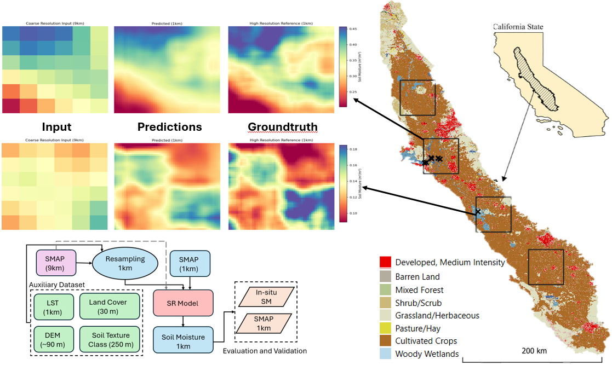
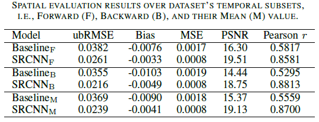
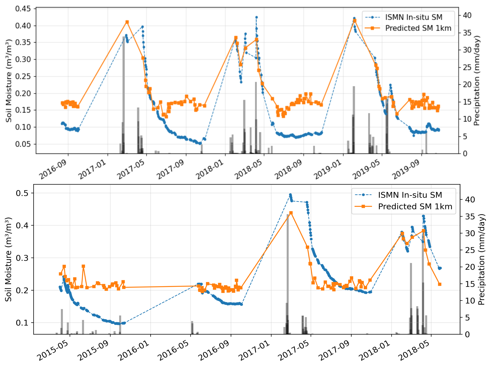

# SMSR-CV — Thermal Guided Super-Resolution for Real-time SMAP Downscaling (GRSL 2026)

Code repository for:

> Rafique, Hamza and Muhammad, Abubakr, Jawairia A. Ahmad, **“Thermal Guided Super Resolution for Real-time SMAP Downscaling”**, *IEEE Geoscience and Remote Sensing Letters (GRSL)*, 2026.



---

## Dataset availability

The dataset used in this work **will be released upon publication** of the associated GRSL article.

---

## Environment setup (Conda)

This repo provides a Conda environment file: `requirements.yml`.

Create and activate the environment:

```bash
conda env create -f requirements.yml
conda activate geo
```

---

## Configuration

Experiments are controlled via YAML (default: `configs/config.yaml`).

Key fields (high level):
- `paths.*`: dataset locations and output/checkpoint locations
- `training.*`: epochs, batch size, LR, early stopping, etc.
- `data.*`: coarse/fine resolution, scaling factor, number of input channels
- `model.*`: architecture selection

---

## Run training / testing (via `main.py`)

### Train

```bash
python main.py --stage train --config configs/config.yaml
```

### Test

```bash
python main.py --stage test --config configs/config.yaml
```

---

## Ablations and validations

- For **Ablations** and **validations** See: `ablation.py`, `ablation_v2.py`, and `validations.py`.

---

## Results (spatial + ISMN validations)

### Spatial results



### ISMN validations



---

## Contact

- For questions or collaborations, please contact the the authors via [LinkdIn](www.linkedin.com/in/hamza-rafique-ac952) or [email](22060019@lums.edu.pk).
---
## Citation

If you use this code, please cite:

```bibtex
@article{rafique2026thermal_smap_sr,
  title   = {Thermal Guided Super Resolution for Real-time SMAP Downscaling},
  author  = {Rafique, Hamza and Muhammad, Abubakr and Ahmad, Jawairia A.},
  journal = {IEEE Geoscience and Remote Sensing Letters},
  year    = {2026},
  note    = {Code: https://github.com/LUMS-WIT/SMSR-CV}
}
```
